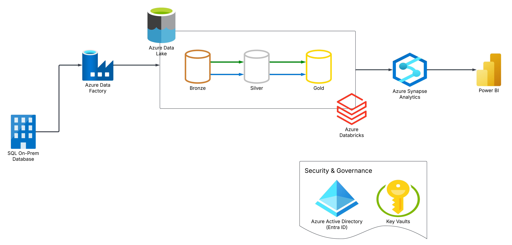

# Azure-Data-Engineering
This project is a cloud-based data engineering pipeline, designed to enhance my understanding of data workflows in Azure. The objective is to extract, transform, and visualize business data efficiently.

## Overview
This solution addresses a business challenge by constructing an end-to-end data pipeline using Azure services. The pipeline extracts customer and sales data from an **on-premises SQL Server**, processes it in the cloud, and generates insightful reports using **Power BI**. The final dashboard provides key performance metrics related to customer demographics and product sales, allowing stakeholders to filter data based on product category, gender, and time.

## Business Requirements
The business seeks to gain deeper insights into customer purchasing behavior, with a focus on gender-based sales trends. The primary objectives include:
 - **Sales Analysis by Gender and Product Category**: A dashboard displaying total products sold, revenue generated, and customer gender distribution.
 - **Interactive Filtering**: Users should be able to filter data by category, gender, and date range.
 - **User-Friendly Dashboard**: A simple and intuitive interface for decision-makers.

## Solution Breakdown

To meet these objectives, the architecture consists of the following components:
1. **Data Ingestion**:
   - Extract customer and sales data from the **on-premises SQL Server**.
   - Transfer data to **Azure Data Lake Storage (ADLS)** via **Azure Data Factory (ADF)**.
2. **Data Processing and Transformation**:
   - Use **Azure Databricks** for data cleansing and transformation.
   - Implement the **Bronze, Silver, and Gold architecture** for managing raw, processed, and curated data.
3. **Data Storage and Reporting**:
   - Load refined data into **Azure Synapse Analytics** for structured analysis.
   - Develop a **Power BI** dashboard to present sales insights.
4. **Automation**:
   - Schedule the pipeline to run daily, keeping data and reports up to date.

## Technology Stack
- **Azure Data Factory (ADF)**: Data ingestion and movement.
- **Azure Data Lake Storage (ADLS)**: Central storage for raw and processed data.
- **Azure Databricks**: Data transformation and aggregation.
- **Azure Synapse Analytics**: Data warehousing and analysis.
- **Power BI**: Data visualization and reporting.
- **Azure Key Vault**: Secure management of credentials.
- **SQL Server (On-Premises)**: Data source.

## Setup Instructions
### Prerequisites
- Active **Azure subscription**.
- Access to an on-premises SQL Server database.
### Step 1: Azure Resource Setup
1. **Create a Resource Group**.
2. **Provision Azure Services**:
   - Set up **Azure Data Factory**.
   - Configure **Azure Data Lake Storage** with Bronze, Silver, and Gold containers.
   - Create an **Azure Databricks** workspace and **Azure Synapse Analytics** instance.
   - Configure **Azure Key Vault** for credential management.
### Step 2: Data Ingestion
1. **Prepare SQL Server**:
   - Install **SQL Server** and **SQL Server Management Studio (SSMS)**.
   - Restore a sample database like **AdventureWorks**.
2. **Load Data using ADF**:
   - Build pipelines to transfer SQL data to ADLS Bronze layer.
### Step 3: Data Transformation
1. **Mount ADLS in Databricks**.
2. **Process Data**:
   - Use Databricks notebooks to transform and enrich data.
   - Move data from **Bronze → Silver → Gold**.
### Step 4: Data Storage and Visualization
1. **Load Data into Synapse**:
   - Configure a Synapse SQL pool for analysis.
2. **Develop Power BI Dashboard**:
   - Connect Power BI to Synapse Analytics.
   - Create visualizations for business insights.
### Step 5: Automation and Monitoring
- **Schedule Pipelines**: Automate ADF workflows to run at regular intervals.
- **Monitor Performance**: Utilize Azure monitoring tools to track pipeline execution.
### Step 6: Security and Access Management
- Implement **Role-Based Access Control (RBAC)** using Azure Entra ID (formerly Azure Active Directory).
### Step 7: End-to-End Testing
- **Validate Pipeline Execution**: Ensure data flows correctly from SQL Server to Power BI.
- **Insert New Records**: Verify pipeline updates in real-time.